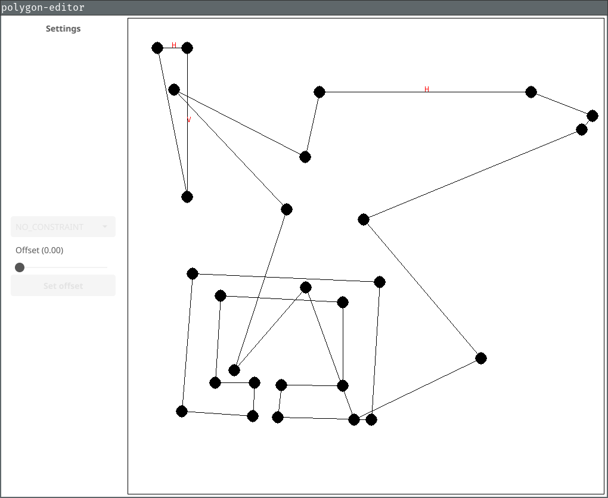
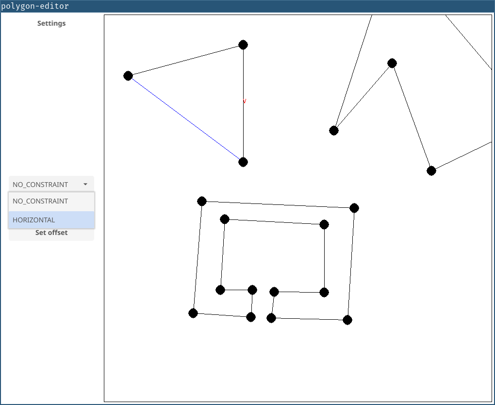
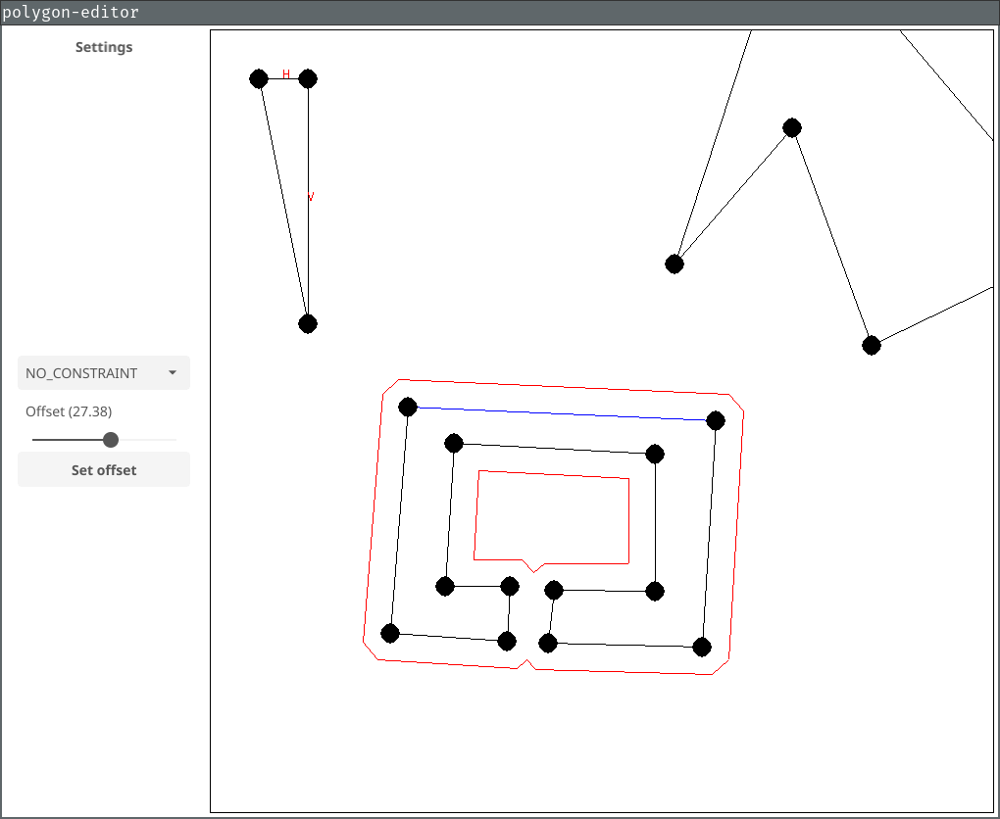

# polygon-editor

**polygon-editor** is a desktop polygon editor with [multi-os support](https://github.com/fyne-io/fyne/wiki/Supported-Platforms). It allows you to create, edit and delete polygonal chains.

## installation

(Go 1.21)[https://go.dev/doc/install]
(Fyne)[https://developer.fyne.io/]
(Fyne dependencies)[https://developer.fyne.io/started/]

## controls

List of controls:

- LMB on segment: select segment and polygon
- LMB not on segment: create new circle
- RMB on circle: delete circle
- RMB on segment: add new circle in the middle of the segment
- LMB DRAG on circle: move circle
- LMB DRAG on segment: move segment
- LMB DRAG on polygon: move polygon

Legend:

- LMB: left mouse button
- RMB: right mouse button
- LMB DRAG: left mouse button press while moving mouse

## featues

List of featuers:

- create circle
- create polygon
- create new circle in the middle of the segment
- remove circle
- move circle
- move segment
- move polygon
- add horizontal constraint to segment
- add vertical constraint to segment
- remove contraint from segment
- create offset to polygon
- manage multiple polygons

## drawing

Circles are drawn using [midpoint circle algoritm](https://en.wikipedia.org/wiki/Midpoint_circle_algorithm).

Lines are drawn using:

- [Bresenham'slinealgorithm](https://en.wikipedia.org/wiki/Bresenham's_line_algorithm)
- [Xiaolin Wu's line algorithm](https://en.wikipedia.org/wiki/Xiaolin_Wu's_line_algorithm) (anti-aliasing)

## offset

Offset algorithm calculates offset points by creating two normals. We add prev segment normal and next segment normal, to get offset polygon point. For concave angle 3 points are created (which next repair algorithm will fix if intersections was introduced). Then fix algorithm looks for intersections. Remove intersections loops (removing intersections) to create proper offset.

## screenshots

## author

Author of this project is Jakub Rudnik.
